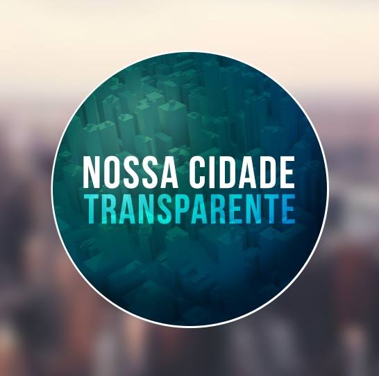
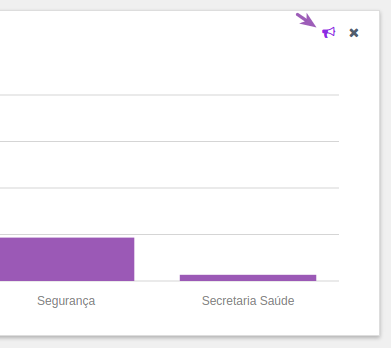

  

<h1 align="center"> Roadmap </h1>

<h2>Onde estamos no momento?</h2>
O projeto está atualmente em desenvolvimento somente nas áreas de Site do aplicativo e Crawlers de alguns municípios.

<h2>Futuro</h2>

- Procurar uma solução de organização de desenvolvedores por cidade, para não ocorrer de um grupo estar desenvolvendo para a mesma cidade sem o conhecimento dos outros, juntos poderiam fazer um código com revisão e limpo.

- Construir um wrapper para executar crawling a partir de um input no website do projeto e retornar como output se a captura foi executada com sucesso e se teve como output o formato esperado para montar os gráficos da UI do portal.  

- Desenvolver uma ferramenta de protesto - e achar um nome para ela e.g.: proteste, reclame... - (como se fosse o like do Facebook, o like do Tinder, etc...) para enviar uma denúncia (gasto, licitação, despesa, viagem, diária) direto para a API da CGU (Controladoria Geral da União). Exemplo abaixo:

  

- Permitir que haja cadastro básico como nome e endereço nos apps (web e mobile) para que surja a oportunidade de, usando a API do Maps, apresentar ao usuário um mapa do seu bairro aproximado com marks (ícones de marcação do Maps) onde poderiam ser marcados objetos com muitas sinalizações de "protesto" (ver item acima) para que o cidadão possa ir verificar casos como por exemplo: empresa existe ou não, endereço comercial ou residencial, se faz sentido ter um escritório tão pequeno com x pessoas e ganhar x milhões. A partir desta funcionalidade, seria possível a criação de salas (ver funcionalidade abaixo).

- Uma outra possível funcionalidade seria a de "Salas", onde para cada objeto de investigação, como uma licitação fraudada ou uma diária extrapolante, seria criado uma Sala no app, como se fosse um chat para discutir sobre aquele gasto. Imagina-se ser um ambiente para livre debate entre lado acusador e prefeitura. (Ideia sugerida: Utilizar apenas uma hash para criar uma sala e ter as conversas por twitter com aquela #, a UI dos apps iriam apenas buscar na API do Twitter pelo termo).

- Possível novo braço do projeto, criar um bot que acompanha o candidato que a pessoa usuária votou e mantém uma troca de mensagens como updates, propostas prometidas x andamento, _reports_ do candidato.

- Uma área nos app's (web e mobile) para visualização dos dados que estão disponibilizados no [TSE](http://divulgacandcontas.tse.jus.br/) sobre os vereadores de cada cidade.
<h2>Quer sugerir algo?</h2>

Sinta-se livre para fazer qualquer sugestão de melhoria, críticas e feedback
<a href="https://github.com/nossacidadetransparente/projeto/issues/new?title=&labels%5B%5D=&assignee=jeanbauer&milestone=fake&body=Quanto_mais_detalhes_melhor!">aqui</a>.

> Todas as funcionalidades/ideias acima estão abertas a serem discutidas.
